# Project overview

This project aims to analyze OCD patients' data to answer different questions about Obsessive-compulsive disorder using different tools.

## Current Project idea summary and main challenges

Studying the  Comorbid Anxiety and Depression in OCD patients, and I aim to use simple EDA as well as ML to predict comorbidity.

## Problem Statement

Obsessive–compulsive disorder (OCD) frequently co-occurs with other psychological conditions, particularly anxiety and depression. These comorbid symptoms may influence treatment response and contribute to poorer long-term outcomes.
This project aims to investigate whether early life stress, obsessive–compulsive symptom patterns, experiential avoidance, and coping styles differ across OCD patients with anxiety symptoms only, and those with both anxiety and depression symptoms.
Understanding these differences is crucial for identifying risk profiles, elucidating underlying mechanisms, and tailoring interventions to meet patient needs.

## Main research question

How do early life dress, obsessive compulsive symptoms, experiential avoidance, and coping style differ between  OCD patients with anxiety symptoms and patients with both anxiety and depression symptoms?

The co-occurring mental problems in this research are only anxiety and depression

## Project objectives and main points

**one**: using HADS (to measure anxiety and depression) with a threshold of 8 classify people to:

* anxiety symptoms only
* depression and anxiety symptoms

**Two**: study the differences between the above categories and other problems like childhood trauma and coping style, as well as OCD severity and other symptom dimensions.

**Three**: build an ML model to predict the above classes based on things like CATS score (Child abuse and trauma scale), Coping style (active coping and planing) from the COPE scale, experiential avoidance scale as well as OCD symptoms severity and type.

## Data used

please refer to [this link](https://datashare.ed.ac.uk/handle/10283/8698#:~:text=Participants%20were%20also%20asked%20to,was%20also%20recorded) that has the original data used in this project from the university of Edinburgh data share under this License [Creative Commons License: Attribution 4.0 International](https://datashare.ed.ac.uk/bitstream/handle/10283/8698/license_text?sequence=5&isAllowed=y)

### Data Citation

Kirkham, Elizabeth; Król, Martyna; Cao, Yintao. (2024). Associations between obsessive-compulsive disorder, early life stress, psychological variables and treatment resistance, [dataset]. University of Edinburgh. [https://doi.org/10.7488/ds/7661](https://doi.org/10.7488/ds/7661)

### Data Description

This dataset was collected using an online survey between May and July 2022. People with and without obsessive-compulsive disorder (OCD; n = 390) were asked to complete a survey which included the following questionnaires: Obsessive-Compulsive Inventory Revised (OCI-R); Child Abuse and Trauma Scale (CATS; Sanders & Becker-Lausen, 1995); Brief Experiential Avoidance Questionnaire (BEAQ; Gamez et al., 2014); Hospital Anxiety and Depression Scale (HADS; Zigmond & Snaith, 1983); and the "Planning" and "Active Coping" subscales of the Coping Orientation to Problems Experienced (COPE) questionnaire (Carver, 1989). Participants were also asked to provide information on whether they had OCD (and if it was self- or professionally- diagnosed) and what treatment they had received for OCD. Brief demographic information (age, gender, ethnicity, university attendance) was also recorded.

### Important notes

1. the description of the original data under the `Data Description` heading above was copied from the website.
2. in my project I edited and cleaned the data and I will provide a description and data dictionary for the edited and cleaned data, lines of code used will also be provided as much as possible.

**NOTE**: adjustments could be made as the project is evolving

### Personal learning goals

* Reinforce data science knowledge.

* Apply machine learning

### To Easily navigate the repository

* to find the data the raw and cleaned data and data dictionaries [in this folder](data)

* to find the notebooks that are used to clean data [in this folder](cleaning_notebooks)

* [data analysis notebooks](data_exploration_and_analysis)

## Tha analysis (Part one)

### research question answer

### 1. Coping (active coping strategy)

this scale measures weather an individual use active coping strategy to deal with problems, it has 4 statements to measure that.
[for more information about the scale](https://positivepsychology.com/coping-scales-brief-cope-inventory/#:~:text=The%20Brief%20COPE%20Inventory%20consists,University%20of%20California%2C%20San%20Francisco.).

#### active coping statement 1 (I concentrate my efforts on doing something about it)

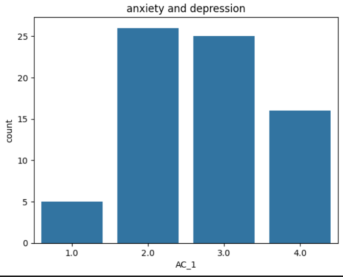

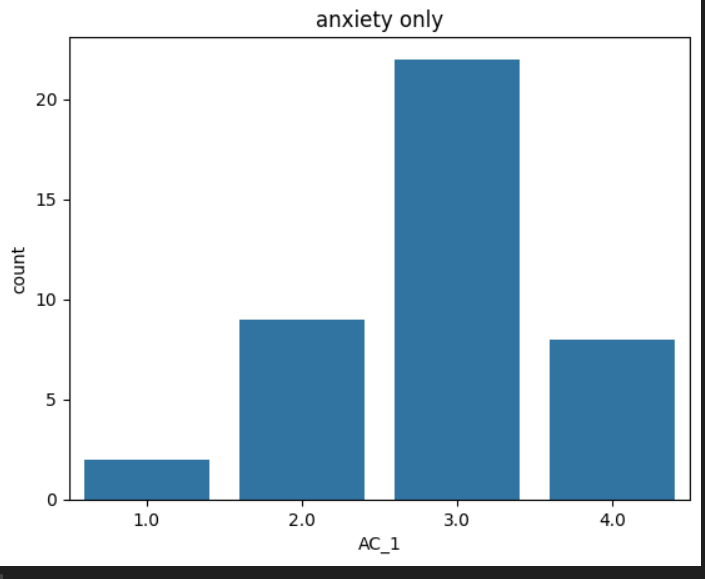

generally category of patients with anxiety symptoms only has less individuals choosing 1 or 2 (low scores), compared to the category of patients with both anxiety and depression symptoms

#### active coping statement 2 (I take additional action to try to get rid of the problem.)

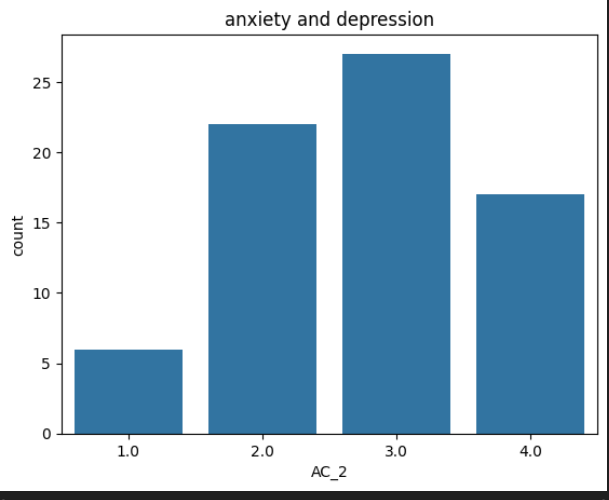

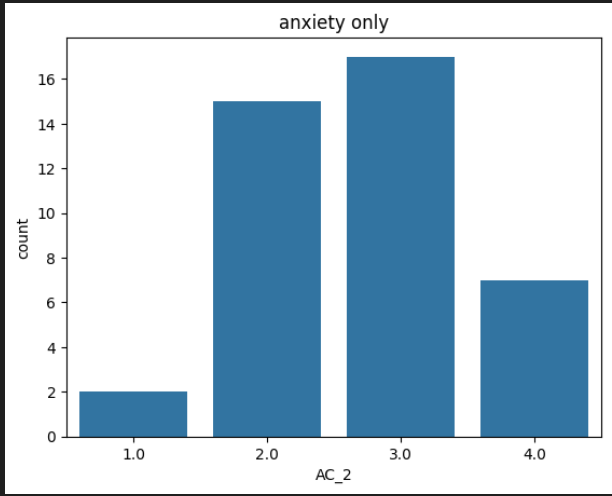
in both categories most people answered (3 or 4) (considered high)

#### active coping statement 3 (I take direct action to get around the problem.)

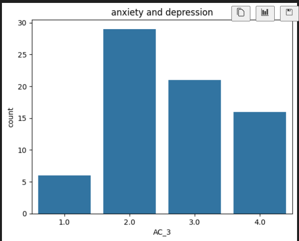

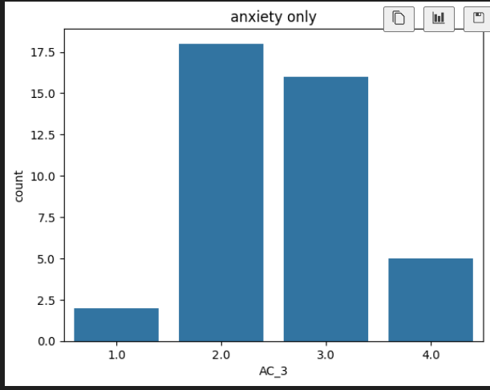

in both categories individuals who chose (1 or 2), are almost equal to individuals who chose (3 or 4)

#### active coping statement 4 (I do what has to be done, one step at a time.)

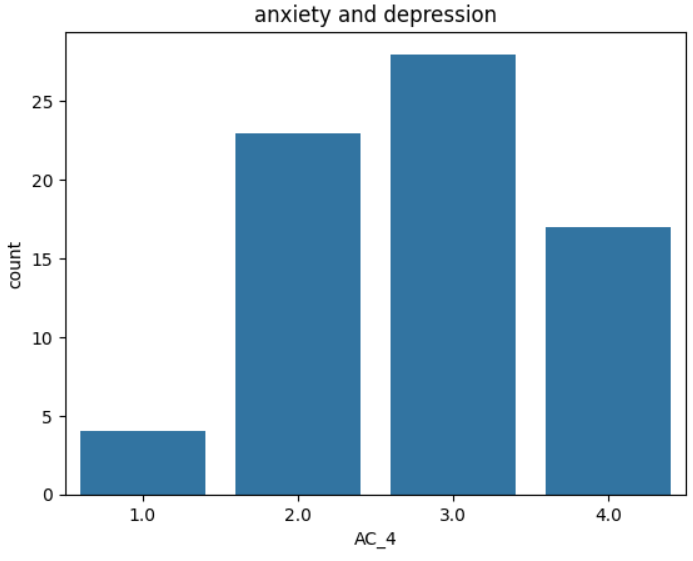

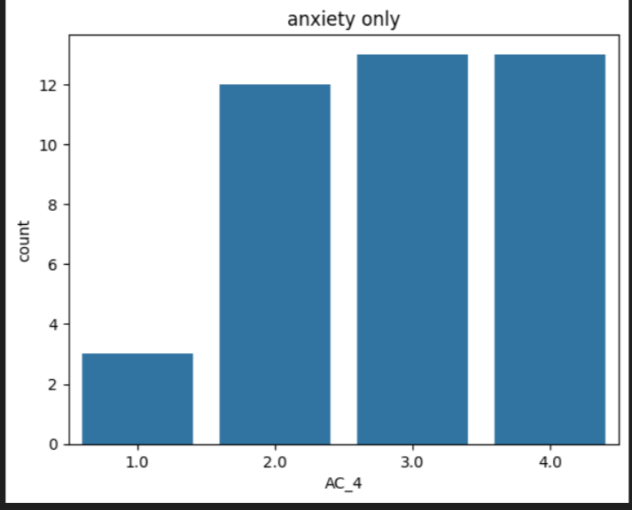

in both categories most patients chose higher scores(3 or 4)

*summary* statement one showed the most difference where there were significantly less individuals choosing lower scored(1 or 2) in the anxiety symptoms only category wheres other statements showed almost similar distribution for both categories (anxiety symptoms only, anxiety and depression symptoms)

### 2. Coping (planning coping strategy)

this scale measures weather an individual use planning as a coping strategy to deal with problems
[for more information about the scale](https://positivepsychology.com/coping-scales-brief-cope-inventory/#:~:text=The%20Brief%20COPE%20Inventory%20consists,University%20of%20California%2C%20San%20Francisco.).

#### planning statement 1 (I make a plan of action.)

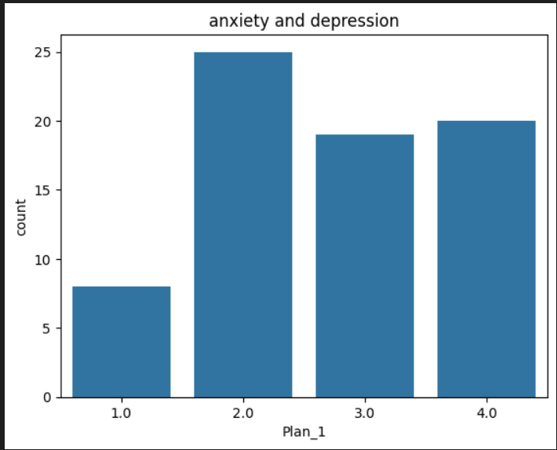

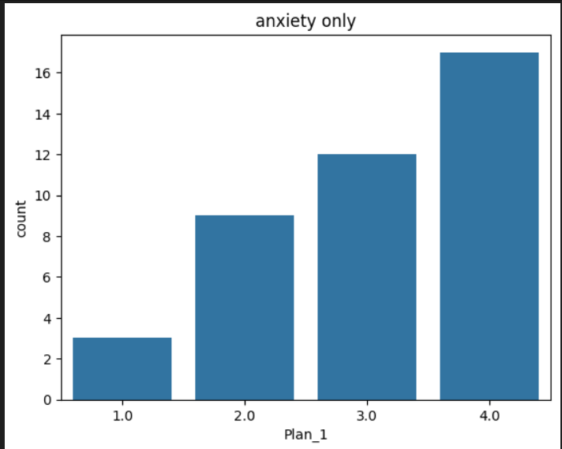

generally individuals that chose (2)(low score) are less in the anxiety symptoms  only category compared  to other scores whereas  individuals that chose (2)(low score) are more compared to other scores in the anxiety and depression symptoms category.

#### planning statement 2 (I try to come up with a strategy about what to do.)

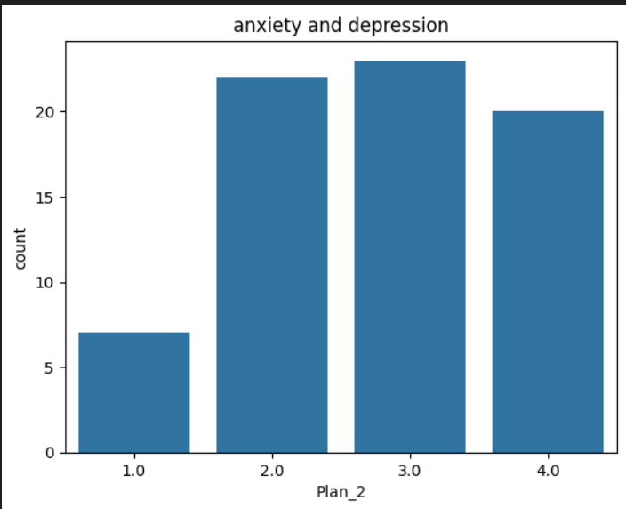

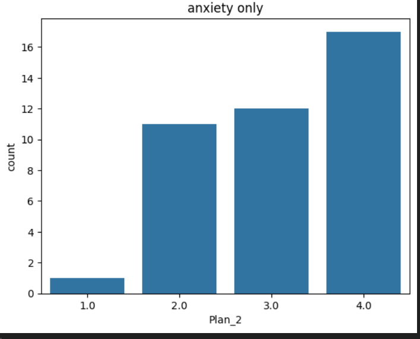

generally in both categories individuals who chose (higher scores)(3 or 4) are higher than individuals who chose (1 or 2)
(low scores), the number of individuals in the anxiety and depression symptoms category who chose 2 is high compared to the other scores whereas the number of individuals choosing 2 is lower in the anxiety symptoms only category compared to the other scores.

#### planning statement 3 (I think about how I might best handle the problem.)

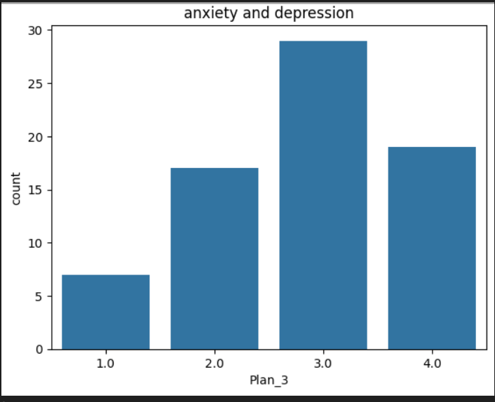

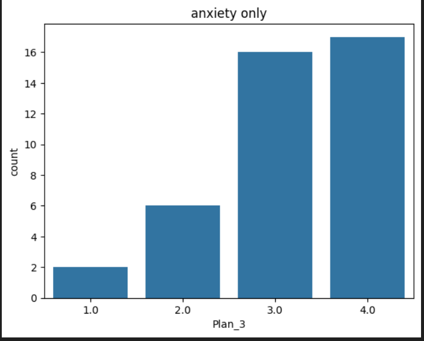

generally in both categories individuals who chose (higher scores)(3 or 4) are higher than individuals who chose (1 or 2)
(low scores)

#### planning statement 4 (I think hard about what steps to take.)

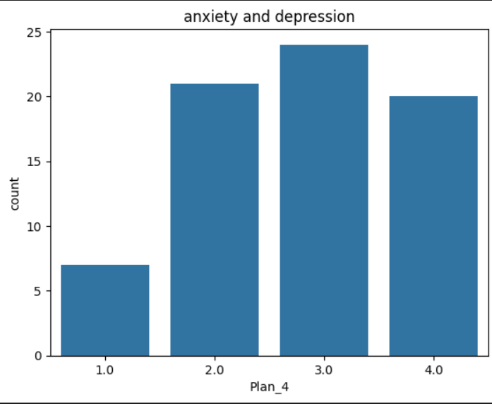

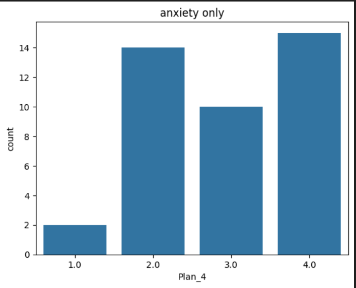

generally in both categories individuals who chose (higher scores)(3 or 4) are higher than individuals who chose (1 or 2)
(low scores)

*summary* statement_one and statement_two:generally individuals that chose (2)(low score) are less in the anxiety symptoms  only category compared  to other scores whereas  individuals that chose (2)(low score) are more compared to other scores in the anxiety and depression symptoms category.

### 3. OCI-R (Total)

obsessive compulsive inventory revised, is used to measure the obsessive compulsive symptoms and has 6 sub-scales

people with both anxiety and depression symptoms reached to scores up to 66, whereas people with anxiety symptoms only has a maximum of 59 on the OCIR scale

### 4. OCI-R (Hoarding subscale)

the OCI-R HOARDING is one of the OCIR sub-scales

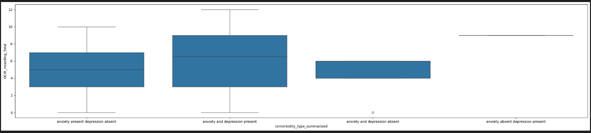

OCIR-hoarding

individuals with both anxiety and depression showed difference in this subscale, compared to the other subscale that did not show much difference

* anxiety and depression symptoms present:

this category has individuals scoring up to 12 on the OCIR-hoarding subscale (highest score)

* anxiety symptoms present depression symptoms absent:

individuals in this category did not reached scores that are greater than 6

### 5. CATS (Total)

the Child abuse and trauma scale has multiple sub-scales to measure types of stress, we used the total as a measure of the early life stress generally

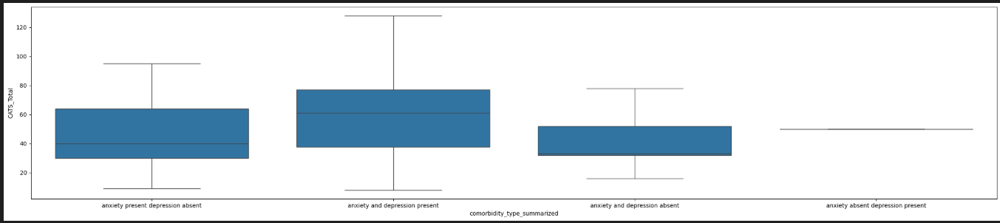

similarly to OCIR, we can also see that people with both anxiety and depression symptoms reached higher scores on the CATS scale (that some scores were never reached by people with anxiety symptoms only)

* anxiety and depression symptom  present:

    With patients reaching scores above 120 (128)

* anxiety present, depression absent:

    0 patients reaching scores above  95

### 6. Brief experiential avoidance (Total)

measure the tendency to to avoid unwanted thoughts and sensations
[for more information about the scale](https://novopsych.com/assessments/formulation/brief-experiential-avoidance-questionnaire-beaq/)

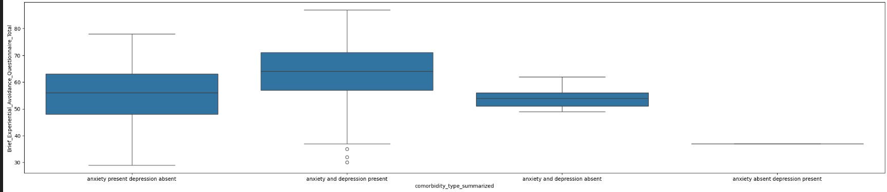

for individuals with both anxiety and depression symptoms the average is between (57-71) and some individuals with both anxiety and depression symptoms reached up to 87 (around 16 pints above average).

for individuals with anxiety symptoms only the average is between (48.0- 63.0), some individuals with anxiety symptoms only scored up to 78

(around 15 pints above average)

we can see that individuals with anxiety and depression symptoms have higher average compared to individuals with anxiety symptoms only.
